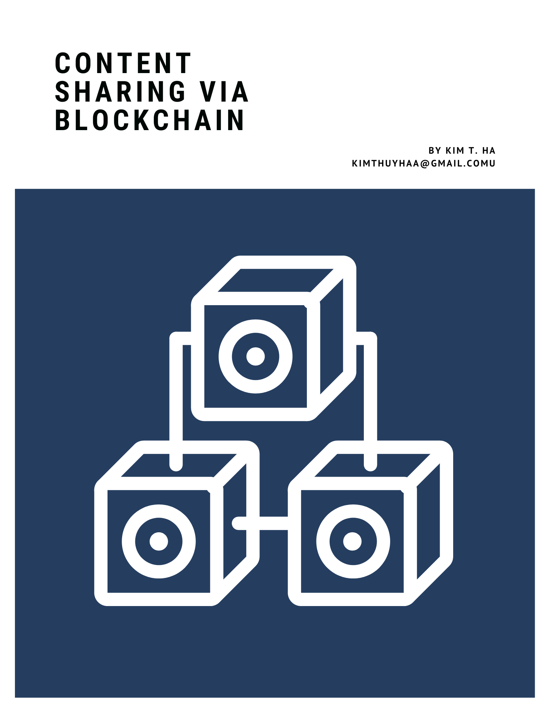

# Conten Sharing Via BlockChain

### A web application that implements blockchain technology

- The application is created by following the tutorial at this page
"https://developer.ibm.com/technologies/blockchain/tutorials/develop-a-blockchain-application-from-scratch-in-python/#1-store-transactions-into-blocks"
- A booklet with the documentation was created. The cover is displayed below. Click [here](https://drive.google.com/file/d/1oocBuq1ipC-odOGMz2jPXNIsbCkDGbZZ/view?usp=sharing) for the full version.

